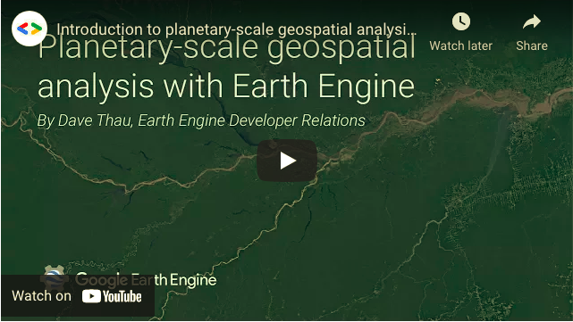

# ResBaz-2021-Introduction-to-GEE
## Introduction to Google Earth Engine workshop 

Google Earth Engine (GEE) is a cloud computing platform designed for analysing geospatial and Earth Observation (EO) data. Most publicly avaiable satellite remote sensing data is readily available and GEE provides you with the tools to access and analyse this data using Google's cloud infrastructure. This allows users to perform complex raster-based analysis quickly and efficiently from any computer with a good internet connection. Many pre-processing steps are already taken care of so the data available is analysis ready, saving even more time. The great thing is using GEE is free for research and non-profit organistations.

I've found GEE particarly useful for my own research, creating pre-processed raster composite images at macro scales (incorporating ~ 1000+ images at a time) to incorporate in python workflows to produce classification outputs. This saves considerable time spent downloading and pre-processing data and avoids constraints on computing resources. The aim of this workshop is to provide you with the fundamental knowldge to consider using GEE for your own geospatial research, focusing on raster-based analysis.  

This is broken down into 3 sessions: 
1. **Intoduction to the GEE code editor, image collections, images and visualisation.**
2. **Image functions, indices, colour palettes and exporting data.**
3. **Importing data and image classification.**

The resources for these sessions can be found in the _resources_ folder in this repo. These practical sessions require that users have a GEE account to follow along with the exercises. Click [here](https://developers.google.com/earth-engine/guides/access) to learn how to get access to Earth Engine. 

Feel free to browse the resources and check out the video below for a nice summary of the GEE platform. 

